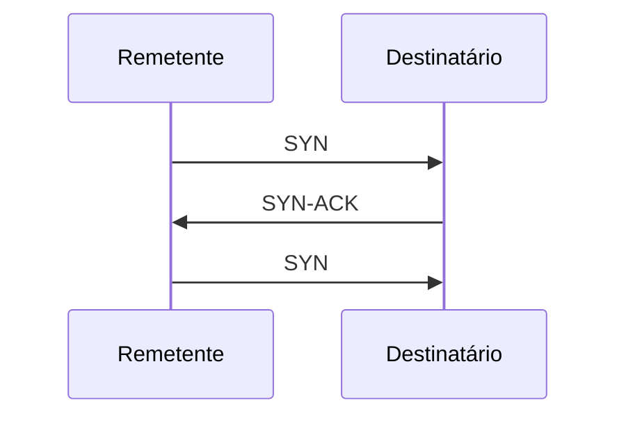
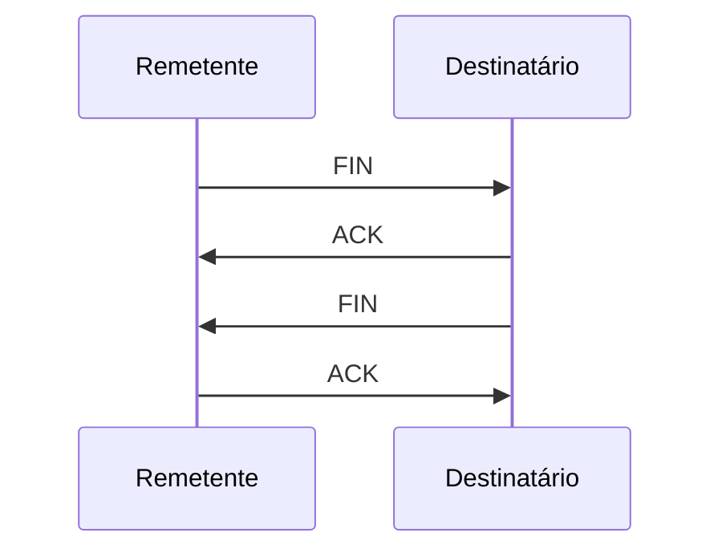
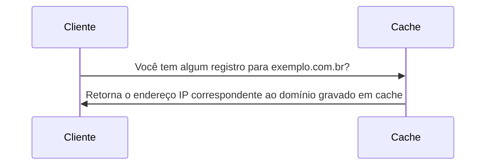
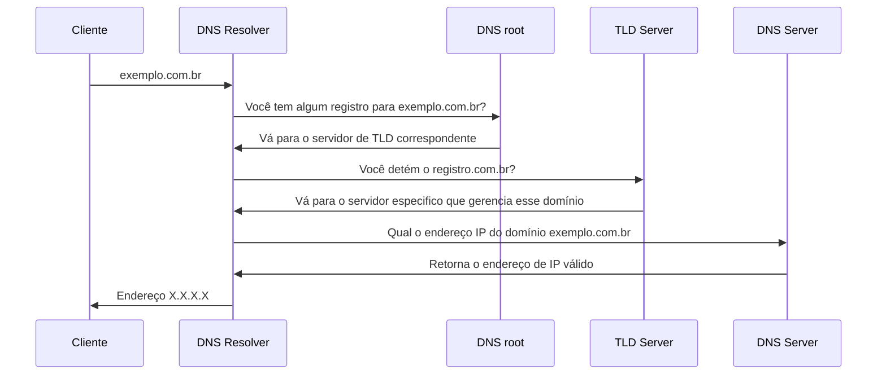

# Introdução

Uma rede de computadores é um conjunto de dispositivos interconectados que se comunicam entre si para compartilhar recursos, dados e informações. Essas redes podem ser pequenas, como uma rede doméstica com alguns dispositivos conectados, ou grandes, como a internet, que conecta bilhões de dispositivos em todo o mundo. Elas usam protocolos e tecnologias específicas para permitir a troca de dados.

Nesse artigo vamos falar da camada física de transmissão até como ocorre a lógica de comunicação dentro dessas redes.

# Comunicação humana e seu paralelo com a comunicação de redes
A espécie humana é inerentemente social, buscando constantemente a troca de informações com seus semelhantes. E para que essa comunicação ocorra de maneira eficaz, é necessário seguir algumas diretrizes.

Tomemos como exemplo uma conversa entre duas pessoas: a comunicação entre elas requer que compartilhem o mesmo idioma, possuam habilidades de fala e audição (ou visão para aqueles com deficiência auditiva), e que o ambiente esteja propício, livre de interferências externas que possam interromper a comunicação.

Neste exemplo, alguns conceitos essenciais se destacam:

- Na comunicação vocal, o ar atua como meio de transmissão para propagar informações.
- O compartilhamento do mesmo idioma entre as pessoas implica em regras comuns, incluindo significados das palavras e normas gramaticais. Estes elementos possibilitam a codificação, transmissão, recepção e compreensão das informações trocadas.
- Um ambiente livre de interferências externas é fundamental para uma comunicação sem ruídos, preservando a integridade das informações durante a transmissão.

Esses conceitos fundamentais são extrapolados para a comunicação entre dispositivos, onde se manifestam como meios de propagação de dados, protocolos e interferências.

# Modelo OSI

Há várias maneiras de abordar a compreensão do funcionamento de uma rede de computadores. Para este propósito, usaremos o modelo OSI (Open System Interconnection), embora existam outros como o TCP/IP.

O modelo OSI segmenta a rede em sete camadas distintas, que vão desde a camada física até as abstrações das aplicações.

Na tabela abaixo mostra cada uma das camadas do modelo.

| Camada | Nome |
|:---:|:---:|
| 1 | Física |
| 2 | Enlace |
| 3 | Redes |
| 4 | Transporte |
| 5 | Sessão |
| 6 | Apresentação |
| 7 | Aplicação |

> Vamos dar uma olhada mais detalhada em algumas dessas camadas a seguir.

## Camada Física

A camada física refere-se ao meio físico usado para transmitir informações, classificado em duas categorias principais, cada uma com seus subgrupos:

1.  Transmissão Guiada
    -   Elétricos
        -   [Coaxial](https://pt.wikipedia.org/wiki/Cabo_coaxial#:~:text=O%20cabo%20coaxial%20%C3%A9%20um,e%20rodeado%20de%20uma%20blindagem)
        -   [Par trançado](https://pt.wikipedia.org/wiki/Cabo_de_par_tran%C3%A7ado)
    -   Óticos
        -   [Fibra óptica](https://pt.wikipedia.org/wiki/Fibra_%C3%B3ptica)
2.  Transmissão Sem Fio
    -   [Ondas eletromagnéticas](https://pt.wikipedia.org/wiki/Espectro_eletromagn%C3%A9tico)

> Para maiores detalhes sobre o funcionamento de redes sem fio recomendo a leitura dos artigos:
> - [Wireless (EN)](https://en.wikipedia.org/wiki/Wireless)
> - [Radio (EN)](https://en.wikipedia.org/wiki/Radio)

### Comunicação de dados

A comunicação ocorre basicamente pela manipulação de duas variáveis, a corrente elétrica (I) e a tensão (V).

> Esses sinais podem ser analisados matematicamente através de uma função de $$ f(t) $$ que representa o comportamento do sinal.
> A análise desses sinais se da utilizando Fourier e caso deseje se aprofundar melhor nesse assunto recomendo dar uma olhada em [séries](https://www.feis.unesp.br/Home/departamentos/engenhariaeletrica/mcap03.pdf) e [transformada](https://www.feis.unesp.br/Home/departamentos/engenhariaeletrica/mcap05.pdf) de Fourier.

### Largura de banda e taxa de transmissão

A largura de banda pode ser fisicamente compreendida como o intervalo de frequência no qual um sinal é transmitido, representado pela diferença entre a maior e a menor frequência ocupada pelo sinal, expressa pela equação $` BW = f_{max} - f_{min} `$.

> Em transmissões de sinal, o corte preciso na frequência nem sempre é alcançado, resultando em um vazamento de sinal com atenuação significativa. Geralmente, esses vazamentos não são considerados na transmissão, a menos que estejamos lidando com interferências.

A largura de banda tem uma influência direta na capacidade de transmissão de bits por um canal. Em muitos casos, é possível calcular a largura de banda utilizando a Equação de Nyquist quando necessário.

$$ T_{bit/s} = 2 \times BW log_2 V $$

Onde:
- $` T_{bit/s} `$ é taxa de transmissão em bits por segundo;
- $` BW `$ é a largura de banda;
- $` V `$ é a quantidade de níveis discretos.

Caso o canal possua interferência é necessário contabilizar a relação de sinal e ruído $` S/N `$ que resulta na seguinte equação modificada.

$$ T_{bit/s} = 2 \times BW log_2 \left ( 1+\frac{S}{N} \right ) $$

> Para mais informações consulte o artigo sobre o [teorema de amostragem de Nyquist-Shannon](https://pt.wikipedia.org/wiki/Teorema_de_Nyquist-Shannon).

### Modulação e multiplexação

#### Modulação

Processo de alterar propriedades físicas do sinal para permitir a transmissão de dados é conhecido como modulação. Alguns exemplos comuns de técnicas de modulação incluem:

- **[Modulação de Amplitude (AM):](https://en.wikipedia.org/wiki/Amplitude_modulation)** Variação da amplitude do sinal portador de acordo com a amplitude do sinal modulante.
- **[Modulação de Frequência (FM):](https://en.wikipedia.org/wiki/Frequency_modulation)** Variação da frequência do sinal portador em relação ao sinal modulante.
- **[Modulação de Fase (PM ou PSK):](https://en.wikipedia.org/wiki/Phase_modulation)** Variação da fase do sinal portador de acordo com o sinal modulante.
- **[Modulação de Quadratura (QAM):](https://en.wikipedia.org/wiki/Quadrature_amplitude_modulation)** Combinação de modulação em amplitude e fase para permitir uma transmissão de dados mais eficiente.

### Multiplexação

Multiplexação é a operação de combinação de sinais em um canal de transmissão. Criando formas mais complexas de transmissão e permitindo que mais informação seja transmitida no canal.

Existem diferentes técnicas de multiplexação:

- **[Multiplexação por Divisão de Tempo (TDM - Time Division Multiplexing)](https://en.wikipedia.org/wiki/Time-division_multiplexing):** Nesse método, o tempo de transmissão é dividido em intervalos fixos e cada fonte de dados transmite durante um intervalo específico. Por exemplo, se há quatro fontes de dados, o canal é dividido em quatro intervalos de tempo e cada fonte transmite em seu intervalo designado.
- **[Multiplexação por Divisão de Frequência (FDM - Frequency Division Multiplexing)](https://en.wikipedia.org/wiki/Frequency-division_multiplexing):** Aqui, diferentes sinais são combinados para ocupar diferentes faixas de frequência dentro do espectro disponível. Cada fonte de dados é associada a uma faixa de frequência distinta, evitando interferências entre elas.
- **[Multiplexação por Divisão de Comprimento de Onda (WDM - Wavelength Division Multiplexing)](https://en.wikipedia.org/wiki/Wavelength-division_multiplexing):** Usado em sistemas ópticos, o WDM permite que múltiplos sinais ópticos sejam transmitidos simultaneamente em uma única fibra óptica, cada um usando um comprimento de onda de luz diferente.
- **[Multiplexação por Divisão de Código (CDM - Code Division Multiplexing)](https://en.wikipedia.org/wiki/Code-division_multiple_access):** Nesse método, os dados são combinados utilizando diferentes códigos de sequência, permitindo que múltiplos sinais ocupem o mesmo intervalo de tempo e frequência, mas sejam separados com base nos códigos exclusivos atribuídos a cada fonte.

## Camada Enlace

Essa camada é também conhecida como camada de acesso ao meio sendo responsável por gerenciar a comunicação confiável e eficiente entre dispositivos na mesma rede local.

Podemos dividir o enlace em duas categorias: as que utilizam conexões ponto a ponto e as que utilizam broadcast.

### Problema da comunicação simultânea

Visualize uma sala de reuniões movimentada, com várias pessoas engajadas em diálogo. Todos têm a oportunidade de expressar seus pensamentos e ouvir uns aos outros. No entanto, quando alguém conclui sua fala, muitos tentam se manifestar ao mesmo tempo.

Como podemos estabelecer um método para permitir ou restringir a fala? No cenário físico, uma solução simples é que aqueles que desejam falar levantem a mão, facilitando a organização e dando voz a um de cada vez.

No entanto, como podemos resolver essa questão em um ambiente virtual ou em rede, onde não é possível usar gestos físicos como levantar a mão?

### Canais e alocação

Quando nos deparamos com uma rede broadcast, onde vários elementos podem transmitir sinais simultaneamente, é comum ocorrer congestão na rede e perda de sinais devido à interferência mútua entre várias fontes.

Para enfrentar esse problema, optamos pela criação de canais de comunicação. Uma abordagem inicial é a distribuição equitativa da largura de banda total disponível na rede entre todos os usuários. Isso é exemplificado nas redes de telefonia E1, onde uma ligação é subdividida em 32 canais, permitindo chamadas simultâneas.

No entanto, esse método de divisão mostra-se ineficiente em situações em que há um número limitado de usuários em comparação com a quantidade de canais disponíveis. Por exemplo, ao ter 32 canais disponíveis, mas apenas dois usuários ativos, os outros 30 canais permanecerão inutilizados, resultando em uma utilização extremamente ineficiente da largura de banda.

A solução para isso é adotar a alocação dinâmica de canais. No entanto, para que isso funcione adequadamente, algumas premissas devem ser atendidas:

- **Trafego independente:** Este modelo consiste em N estações independentes, como computadores ou telefones, cada uma operada por um programa ou usuário que gera quadros para transmissão. A quantidade esperada de quadros gerados em um intervalo de duração $` \Delta t `$ é $` \lambda \Delta t `$, onde $` \lambda `$ é uma constante representando a taxa de chegada de novos quadros. Após a geração de um quadro, a estação entra em um estado bloqueado, aguardando até que o quadro seja transmitido com sucesso.
- **Canal único:** Há um único canal disponível para todas as comunicações, permitindo que todas as estações transmitam e recebam por ele. Embora todas as estações sejam consideradas igualmente capazes, os protocolos podem atribuir diferentes papéis (como prioridades) a elas.
- **Colisões observáveis:** Se dois quadros forem transmitidos simultaneamente, eles se sobreporão no tempo, resultando em uma colisão que adultera o sinal. Todas as estações são capazes de detectar colisões. Um quadro que tenha sofrido colisão precisará ser retransmitido posteriormente. Não existem outros erros além daqueles gerados por colisões.
- **Tempo contínuo ou segmentado:** O tempo pode ser considerado contínuo, permitindo que a transmissão do quadro comece a qualquer momento. Alternativamente, o tempo pode ser dividido em intervalos discretos (slots). As transmissões de quadros sempre iniciam no início de um slot. Um slot pode conter 0, 1 ou mais quadros, indicando um slot ocioso, uma transmissão bem-sucedida ou uma colisão, respectivamente.
- **Detecção de portadora ou sem detecção de portadora:** Com a premissa de detecção de portadora, as estações podem detectar se o canal está em uso antes de tentar transmitir. Se o canal estiver ocupado, nenhuma estação tentará utilizá-lo até que ele fique livre. Sem a detecção de portadora, as estações não conseguem detectar a ocupação do canal antes da tentativa de transmissão. Elas simplesmente prosseguem com a transmissão e só posteriormente determinam se foi bem-sucedida ou não.

> Caso esteja interessado em saber mais sobre as diferentes formas de resolver esses problemas sugiro dar uma pesquisada sobre os protocolos e conceitos [ALOHA](https://pt.wikipedia.org/wiki/ALOHAnet), [CSMA](https://www.geeksforgeeks.org/carrier-sense-multiple-access-csma/), [BIT-MAP](https://www.geeksforgeeks.org/collision-free-protocols-in-computer-network/) e [TREE WALK](https://copyprogramming.com/howto/the-adaptive-tree-walk-protocol).

### Ethernet

Basicamente a forma de comunicação mais comum utilizada, mas ela pode ser dividida de duas formas:
- **Clássica:** que resolve o problema de acessos múltiplos utilizando as diferentes técnicas de alocação de canais apresentadas ou referenciadas anteriormente (Descontinuada).
- **Comutada:** utilizando um dispositivo de comutação (switch) que cria canais de comunicação ponto a ponto (modelo atual).

### MAC Ethernet

O endereço MAC (Media Access Control) é um identificador exclusivo atribuído a cada dispositivo de comunicação em uma rede. Ele é essencial para o encaminhamento de pacotes entre dispositivos dentro dessa rede. Esse endereço é pré-definido pelos fabricantes nas placas de rede (Network Interface Card), porém, pode ser alterado de forma lógica, o que abre brechas para técnicas como o MAC Spoofing.

O endereço MAC é constituído por 12 caracteres alfanuméricos, que podem ser representados como "00:00:00:00:00:00", incluindo caracteres de 0 a 9 e letras de A a F, representando valores hexadecimais.

> As atribuições de endereços MAC válidos são regidos pela [Registration Authority](https://standards.ieee.org/products-programs/regauth/) do [IEEE](https://www.ieee.org/).

#### Estrutura de um endereço MAC

| Bytes | 8 | 6 | 6 | 2 | 0-1500 | 0-46 | 4 |
|---|---|---|---|---|---|---|---|
| Componente | Preâmbulo | Endereço de destino | Endereço de origem | Tipo | Dados | Preenchimento | Check-sum |

> Os padrões de comunicação em redes locais e metropolitanas são estabelecidas pelas normas da série IEEE 802.x.

> Os protocolos de redes sem fio adicionam diversas complexidades e são definidos pelo normativo IEEE 802.11 e IEEE 802.1x.

> É possível o controle do tamanho do pacote através da alteração do [MTU](https://pt.wikipedia.org/wiki/Unidade_m%C3%A1xima_de_transmiss%C3%A3o).

## Camada de Redes e Transporte

### Pacotes

Um (pacote)[https://en.wikipedia.org/wiki/Network_packet] de rede é uma unidade de informação organizada e estruturada para ser transmitida através de uma rede de computadores. Ele contém dados, metadados e informações de controle necessárias para o envio e a entrega bem-sucedida dos dados de origem ao destino desejado. Essencialmente, o pacote é a unidade fundamental de comunicação em redes.

A estrutura de um pacote de rede segue um formato padronizado. Geralmente, é composto por três partes principais: o cabeçalho (header), o corpo (payload) e o rodapé (trailer). O cabeçalho contém informações cruciais, como endereços de origem e destino, protocolos utilizados, informações de roteamento e outras metainformações necessárias para o encaminhamento correto do pacote pela rede.

| Header | Payload | Trailer |

O corpo do pacote, ou payload, é a parte que carrega os dados reais que estão sendo transmitidos. Pode conter qualquer tipo de informação, desde texto e imagens até comandos de software, dependendo do propósito da transmissão. Por fim, o rodapé (trailer) é responsável pela verificação de erros, incluindo códigos de redundância cíclica (CRC) ou outros mecanismos para garantir que o pacote não tenha sido corrompido durante a transmissão.

Antes de ser enviado, o pacote é segmentado em unidades menores, se necessário, para se adequar aos limites de tamanho estabelecidos pela tecnologia de rede utilizada. Cada segmento é encapsulado com os cabeçalhos e rodapés necessários para garantir que a informação seja transmitida corretamente e possa ser reagrupada e decodificada no destino.

Quando o pacote é enviado, ele atravessa a rede, passando por roteadores e switches, onde os cabeçalhos são examinados para determinar a rota adequada até o destino. No destino final, os pacotes são recebidos, os cabeçalhos são removidos e os dados originais são reconstituídos para serem utilizados pela aplicação ou dispositivo receptor. Essa estruturação cuidadosa e padronizada do pacote é essencial para garantir uma comunicação eficiente e confiável em redes de computadores.

### Roteamento

O roteamento é o processo fundamental para encaminhar dados entre dispositivos em redes de computadores. Quando um dispositivo precisa enviar informações para outro na rede, ele identifica o endereço de destino, normalmente um endereço IP. Em seguida, o dispositivo determina o caminho mais eficiente para que os dados atinjam o destino desejado.

Essa determinação do caminho mais eficiente é realizada pelos roteadores, que analisam as informações dos pacotes de dados e utilizam protocolos de roteamento para tomar decisões. Existem diversos protocolos, como [OSPF (Open Shortest Path First)](https://en.wikipedia.org/wiki/Open_Shortest_Path_First), [BGP (Border Gateway Protocol)](https://en.wikipedia.org/wiki/Border_Gateway_Protocol), e [RIP (Routing Information Protocol)](https://en.wikipedia.org/wiki/Routing_Information_Protocol), cada um com suas próprias características e usos específicos.

Os roteadores utilizam algoritmos, como o algoritmo de [Dijkstra](https://en.wikipedia.org/wiki/Dijkstra%27s_algorithm), por exemplo, para calcular o menor caminho entre o dispositivo de origem e o destino. Esse processo leva em consideração várias métricas, como a velocidade da conexão, o número de saltos (roteadores intermediários) e a disponibilidade do caminho.

Assim, os roteadores baseiam suas decisões na análise desses fatores, consultando tabelas de roteamento e protocolos específicos, a fim de direcionar os dados pelo caminho mais eficiente possível. Esse encaminhamento cuidadoso e inteligente é essencial para garantir que os dados sejam entregues com sucesso ao seu destino final na rede de computadores.

### Inundação

Conhecido como flooding, é um método de roteamento empregado quando não há conhecimento prévio da rota mais eficiente para um destino específico. Esse processo começa quando um roteador recebe um pacote de dados destinado a um local desconhecido. Sem verificar se é a rota correta, o roteador replica esse pacote para todos os seus vizinhos, exceto para aquele de onde o pacote foi recebido. Esse padrão de retransmissão é replicado por cada roteador vizinho que recebe o pacote, criando um espalhamento generalizado dos dados pela rede.

Para evitar loops infinitos e controlar a propagação descontrolada dos pacotes, os roteadores mantêm tabelas de controle, como o [TTL](https://pt.wikipedia.org/wiki/Time_to_Live) (Time To Live), que determina quantos saltos um pacote pode dar antes de ser descartado. Se um pacote alcança o limite de saltos sem chegar ao destino, é descartado para evitar congestionamento excessivo na rede.

O objetivo final do flooding é permitir que os pacotes atinjam o destino ou um roteador que possa encaminhá-los para o destino correto. Uma vez que o pacote chegue a esse ponto, a rota é aprendida e armazenada para ser usada posteriormente, evitando assim a necessidade de continuar o processo de flooding para pacotes futuros destinados a esse mesmo destino. Embora eficaz em disseminar informações em redes onde as rotas são desconhecidas, o flooding pode gerar tráfego excessivo e ineficiência em redes maiores, razão pela qual métodos mais sofisticados são preferidos em ambientes complexos.

### MTU

O (MTU)[https://en.wikipedia.org/wiki/Maximum_transmission_unit], sigla para Maximum Transmission Unit (Unidade Máxima de Transmissão), representa o tamanho máximo de um pacote de dados que pode ser transmitido em uma única vez em uma determinada rede. Em termos mais simples, é a maior quantidade de dados que um protocolo de comunicação pode enviar em uma única transmissão sem ser fragmentado em partes menores.

Esse valor é definido pela tecnologia de rede e pode variar dependendo do tipo de conexão ou protocolo utilizado. Redes Ethernet, por exemplo, frequentemente têm um MTU padrão de 1500 bytes (mínimo de 46 bytes), enquanto outras tecnologias podem ter MTUs diferentes.

É crucial que os dispositivos em uma rede concordem com o mesmo valor de MTU para garantir a comunicação eficiente. Se um pacote for maior que o MTU permitido em uma rede específica, ele será fragmentado em pedaços menores antes da transmissão. No destino, esses fragmentos são reagrupados para reconstituir o pacote original.

Problemas podem surgir se os dispositivos em uma rede tiverem diferentes valores de MTU configurados. Isso pode resultar em fragmentação excessiva, overhead de rede e até mesmo na perda de dados, já que alguns roteadores podem bloquear pacotes muito grandes.

> O tamanho do MTU pode ser maior do que a especificação quando estamos lidando com aplicações especificas como a conexão de um NAS a um servidor. Para entender como esse tipo de comunicação funciona leia o artigo especifico de (Jumbogram)[https://en.wikipedia.org/wiki/Jumbogram] disponível na Wikipedia.

### TCP

O (Transmission Control Protocol (TCP))[https://en.wikipedia.org/wiki/Transmission_Control_Protocol] é um protocolo de comunicação orientado à conexão, no nível de transporte do modelo TCP/IP. Antes de iniciar a transmissão de dados, o TCP estabelece uma conexão entre o remetente e o destinatário por meio de um processo de três vias conhecido como "handshake".

O handshake TCP inicia com o envio de um segmento SYN (synchronize flag / flag de sincronização) pelo dispositivo remetente para o destinatário. Esse segmento contém um número de sequência inicial e uma solicitação de conexão. O destinatário responde com um segmento SYN-ACK (acknowledgement flag / flag de reconhecimento ), indicando que a conexão foi aceita e pronto para receber dados, junto com seu próprio número de sequência e um ACK (acknowledge) confirmando a recepção do número de sequência inicial.

O remetente então responde com um segmento ACK, confirmando a recepção do SYN-ACK e indicando que a conexão foi estabelecida. Com isso, a conexão TCP é iniciada e os dados podem ser transmitidos.

Durante a transmissão de dados, o TCP divide os dados em segmentos menores e adiciona informações de cabeçalho a cada segmento, incluindo números de sequência, números de confirmação, janelas de recepção e informações de controle. Os segmentos são enviados ao destinatário, e o TCP utiliza mecanismos de confirmação de recebimento (acknowledgment) e retransmissão para garantir a entrega confiável.

Quando a transmissão é concluída, o processo de encerramento da conexão é iniciado com um handshake de quatro vias. O remetente envia um segmento FIN (finish / finalização) para indicar que não enviará mais dados, e o destinatário responde com um ACK confirmando a recepção do segmento FIN. Em seguida, o destinatário envia um segmento FIN ao remetente, que responde com um ACK. Com isso, a conexão é encerrada de forma ordenada.

O TCP é altamente confiável devido aos seus mecanismos de controle e verificação, incluindo números de sequência, confirmações, retransmissões e timeouts. Esses processos garantem a entrega ordenada e confiável dos dados, mesmo em ambientes de rede propensos a congestionamento ou perda de pacotes.

### UDP

O [User Datagram Protocol (UDP)](https://en.wikipedia.org/wiki/User_Datagram_Protocol) é outro protocolo de transporte no modelo TCP/IP, porém, ao contrário do TCP, o UDP é um protocolo de transmissão não orientado à conexão e não confiável.

No UDP, não há processo de handshake para estabelecer uma conexão entre o remetente e o destinatário, nem há confirmações de recebimento ou retransmissões automáticas de pacotes. Isso significa que não há garantia de entrega ou ordenação dos dados.

Ao contrário do TCP, o UDP não mantém um estado de conexão. Assim, quando um dispositivo deseja enviar dados usando o UDP, ele simplesmente encapsula os dados em datagramas UDP, que consistem em um cabeçalho mínimo (contendo informações de porta de origem, porta de destino e tamanho do datagrama) e o payload, que contém os dados a serem transmitidos.

Os datagramas UDP são enviados ao destinatário sem qualquer confirmação de entrega ou controle de fluxo. Isso resulta em uma transmissão mais rápida, sem a sobrecarga associada aos mecanismos de controle de erro e confirmação do TCP. No entanto, essa abordagem de "disparar e esquecer" pode resultar na perda de pacotes, duplicação de dados ou entrega fora de ordem.

O UDP é frequentemente usado em aplicativos onde a perda ocasional de dados não é crítica, como em transmissões de áudio ou vídeo em tempo real, jogos online e serviços de transmissão de dados que priorizam a velocidade sobre a precisão. A simplicidade do UDP o torna uma escolha popular quando a latência é mais crucial do que a confiabilidade absoluta na entrega dos dados.

### IPv4

O [IPv4](https://pt.wikipedia.org/wiki/Protocolo_de_Internet) é um protocolo de camada de rede no modelo TCP/IP e é composto por um endereçamento de 32 bits. Esses endereços são organizados em quatro octetos (ou 4 conjuntos de 8 bits) e representados na forma decimal pontuada. Isso possibilita a alocação de aproximadamente 4,3 bilhões de endereços únicos.

Um exemplo de cabeçalho TCP/IPv4 está na tabela a seguir:

<table>
<thead>
  <tr>
    <th>+</th>
    <th>0-3</th>
    <th>4-7</th>
    <th>8-15</th>
    <th>16-18</th>
    <th>19-31</th>
  </tr>
</thead>
<tbody>
  <tr>
    <td>0</td>
    <td>Versão</td>
    <td>Tamanho do cabeçalho</td>
    <td>Tipo de Serviço</td>
    <td colspan="2">Comprimento</td>
  </tr>
  <tr>
    <td>32</td>
    <td colspan="3">Identificador</td>
    <td>Flags</td>
    <td>Offset</td>
  </tr>
  <tr>
    <td>64</td>
    <td colspan="2">Tempo de Vida (TTL)</td>
    <td>Protocolo</td>
    <td colspan="2">Checksum</td>
  </tr>
  <tr>
    <td>96</td>
    <td colspan="5">Endereço de origem</td>
  </tr>
  <tr>
    <td>128</td>
    <td colspan="5">Endereço de destino</td>
  </tr>
  <tr>
    <td>160</td>
    <td colspan="5">Opções</td>
  </tr>
  <tr>
    <td>192</td>
    <td colspan="5">Dados</td>
  </tr>
</tbody>
</table>

O IPv4 utiliza classes de endereços para determinar o tamanho da rede e o número de hosts em cada rede. As classes A, B e C são as principais classes usadas para endereços de hosts, variando no número de bits reservados para a identificação da rede e do host. As classes D e E são reservadas para multicast e propósitos experimentais, respectivamente.

A comunicação no IPv4 é baseada em datagramas. Cada datagrama contém informações de cabeçalho e dados. O cabeçalho inclui informações essenciais, como endereços de origem e destino, identificadores de pacotes, além de informações de controle e verificação de integridade.

A entrega de pacotes no IPv4 é realizada por meio de roteadores. Esses dispositivos utilizam tabelas de roteamento para determinar o caminho mais eficiente para encaminhar os pacotes através da rede. Essas tabelas são atualizadas e mantidas com base em informações de roteamento, como atualizações de protocolos de roteamento ou configurações manuais.

No entanto, um desafio significativo enfrentado pelo IPv4 é a escassez de endereços disponíveis. Devido ao esgotamento gradual dos endereços IPv4, estratégias como o uso de NAT (Network Address Translation) tornaram-se comuns para permitir que várias máquinas em redes privadas compartilhem um único endereço IP público, prolongando assim a vida útil do endereçamento IPv4 em face da crescente demanda por conectividade.

#### Mascará de rede e classes

A máscara de rede, também conhecida como subnet mask, é um elemento crucial do IPv4 que determina quais bits de um endereço IP pertencem à parte da rede e quais pertencem à parte do host. Ela consiste em uma sequência de bits de 32 bits, onde os bits de rede são representados por 1s contínuos seguidos por 0s para os bits de host. Essa máscara é aplicada aos endereços IP para separar a identificação da rede e do host.

As classes de endereços IPv4 (A, B, C, D e E) determinam a estrutura do endereço e o número de bits alocados para a identificação da rede e do host:

- **Classe A:** As redes de Classe A têm o primeiro bit fixo em 0. O restante dos 7 bits identifica a parte da rede e os 24 bits restantes são usados para endereçar hosts. Isso permite um grande número de redes, mas cada uma com muitos hosts.

- **Classe B:** As redes de Classe B têm os dois primeiros bits fixos em 10. Os 14 bits seguintes são para identificar a rede e os 16 bits finais são para endereçamento de hosts. Isso oferece um equilíbrio entre redes e hosts, sendo usado frequentemente por empresas.

- **Classe C:** As redes de Classe C têm os três primeiros bits fixos em 110. Os 21 bits subsequentes são para identificar a rede e os 8 bits finais são para endereçamento de hosts. Isso oferece um grande número de redes, mas com um número limitado de hosts em cada uma.

- **Classe D:** Reservada para multicast, os quatro primeiros bits são fixos em 1110, sendo os restantes para fins de identificação de grupos de multicast.

- **Classe E:** Reservada para propósitos experimentais, os quatro primeiros bits são fixos em 1111, deixando os restantes para possíveis usos futuros.

Essas classes fornecem estruturas de endereçamento que diferem em termos de número de redes disponíveis e quantidade de hosts permitidos em cada rede. No entanto, devido à escassez de endereços IPv4, estratégias de sub-redes (utilizando máscaras de rede mais curtas) e a adoção do [CIDR (Classless Inter-Domain Routing)](https://en.wikipedia.org/wiki/Classless_Inter-Domain_Routing) foram desenvolvidas para permitir uma alocação mais eficiente de endereços IP.

A tabela completa abaixo mostra todos os códigos CIDR das máscaras de sub-rede:

| CIDR | MÁSCARA DE SUB-REDE | MÁSCARA CORINGA | Nº DE ENDEREÇOS IP | ENDEREÇOS IP USÁVEIS |
|---|---|---|---|---|
| /32 | 255.255.255.255 | 0.0.0.0 | 1 | 1 |
| /31 | 255.255.255.254 | 0.0.0.1 | 2 | 2* |
| /30 | 255.255.255.252 | 0.0.0.3 | 4 | 2 |
| /29 | 255.255.255.248 | 0.0.0.7 | 8 | 6 |
| /28 | 255.255.255.240 | 0.0.0.15 | 16	| 14 |
| /27 | 255.255.255.224 | 0.0.0.31 | 32 | 30 |
| /26 | 255.255.255.192 | 0.0.0.63 | 64 | 62 |
| /25 | 255.255.255.128 | 0.0.0.127 | 128 | 126 |
| /24 | 255.255.255.0 | 0.0.0.255 | 256 | 254 |
| /23 | 255.255.254.0 | 0.0.1.255 | 512 | 510 |
| /22 | 255.255.252.0 | 0.0.3.255 | 1,024 | 1,022 |
| /21 | 255.255.248.0 | 0.0.7.255 | 2,048 | 2,046 |
| /20 | 255.255.240.0 | 0.0.15.255 | 4,096 | 4,094 |
| /19 | 255.255.224.0 | 0.0.31.255 | 8,192 | 8,190 |
| /18 | 255.255.192.0 | 0.0.63.255 | 16,384 | 16,382 |
| /17 | 255.255.128.0 | 0.0.127.255 | 32,768 | 32,766 |
| /16 | 255.255.0.0 | 0.0.255.255 | 65,536 | 65,534 |
| /15 | 255.254.0.0 | 0.1.255.255 | 131,072 | 131,070 |
| /14 | 255.252.0.0 | 0.3.255.255 | 262,144 | 262,142 |
| /13 | 255.248.0.0 | 0.7.255.255 | 524,288 | 524,286 |
| /12 | 255.240.0.0 | 0.15.255.255 | 1,048,576 | 1,048,574 |
| /11 | 255.224.0.0 | 0.31.255.255 | 2,097,152 | 2,097,150 |
| /10 | 255.192.0.0 | 0.63.255.255 | 4,194,304 | 4,194,302 |
| /9 | 255.128.0.0 | 0.127.255.255 | 8,388,608 | 8,388,606 |
| /8 | 255.0.0.0 | 0.255.255.255 | 16,777,216 | 16,777,214 |
| /7 | 254.0.0.0 | 1.255.255.255 | 33,554,432 | 33,554,430 |
| /6 | 252.0.0.0 | 3.255.255.255 | 67,108,864 | 67,108,862 |
| /5 | 248.0.0.0 | 7.255.255.255 | 134,217,728 | 134,217,726 |
| /4 | 240.0.0.0 | 15.255.255.255 | 268,435,456 | 268,435,454 |
| /3 | 224.0.0.0 | 31.255.255.255 | 536,870,912 | 536,870,910 |
| /2 | 192.0.0.0 | 63.255.255.255 | 1,073,741,824 | 1,073,741,822 |
| /1 | 128.0.0.0 | 127.255.255.255 | 2,147,483,648 | 2,147,483,646 |
| /0 | 0.0.0.0 | 255.255.255.255 | 4,294,967,296 | 4,294,967,294 |

> ** /31 é um caso especial detalhado no [RFC 3021](https://datatracker.ietf.org/doc/html/rfc3021) onde as redes com esse tipo de máscara de sub-rede podem atribuir dois endereços IP como link ponto-a-ponto.

> O primeiro e ultimo endereços são reservados e são utilizados pelo gateway e broadcast respectivamente.

### IPv6

O [IPv6](https://pt.wikipedia.org/wiki/IPv6) é a próxima iteração do protocolo de Internet e representa uma evolução significativa em relação ao IPv4. Ele emprega endereços de 128 bits, substancialmente mais longos do que os 32 bits do IPv4. Esse espaço de endereçamento expandido oferece aproximadamente 340 undecilhões (3.4 x 10^38) de endereços únicos, suprindo a demanda por uma quantidade substancialmente maior de dispositivos conectados à Internet.

O cabeçalho simplificado do IPv6 reduz a complexidade de processamento em roteadores e hosts. Essa simplificação é alcançada eliminando campos redundantes, otimizando o formato do cabeçalho e permitindo extensões de cabeçalho. Isso minimiza a carga de processamento nos dispositivos de rede, resultando em operações mais eficientes.

Um exemplo de cabeçalho IPv6 é:

<table>
<thead>
  <tr>
    <th>Versão</th>
    <th>Classe de Tráfego</th>
    <th colspan="2">Identificador de Fluxo</th>
  </tr>
</thead>
<tbody>
  <tr>
    <td colspan="2">Tamanho dos Dados</td>
    <td>Próximo Cabeçalho</td>
    <td>Limite de Encaminhamento</td>
  </tr>
  <tr>
    <td colspan="4">Endereço de Origem</td>
  </tr>
  <tr>
    <td colspan="4">Endereço de Destino</td>
  </tr>
</tbody>
</table>

O [SLAAC (Stateless Address Autoconfiguration)](https://datatracker.ietf.org/doc/html/rfc4862) é uma funcionalidade central do IPv6, permitindo que dispositivos gerem automaticamente seus próprios endereços sem depender de um servidor de configuração central, como é comum no IPv4. Isso simplifica a configuração e a administração de dispositivos em redes IPv6.

Em termos de segurança, o IPv6 oferece suporte nativo a [IPSec](https://datatracker.ietf.org/doc/html/rfc6071), integrando segurança ao nível do protocolo. Isso significa que a criptografia, autenticação e integridade dos dados são incorporadas no protocolo, fornecendo comunicação segura por padrão.

A transição do IPv4 para o IPv6 envolve atualizações e configurações em infraestruturas de rede e dispositivos. Métodos de transição, como dual-stack e mecanismos de tunelamento, permitem a coexistência e a interoperabilidade entre ambas as versões do protocolo durante o período de transição, garantindo a continuidade da conectividade em ambientes híbridos IPv4/IPv6.

A ampla implantação do IPv6 é essencial para atender às crescentes demandas por endereçamento de dispositivos e para garantir a escalabilidade e o crescimento contínuo da Internet, além de mitigar os desafios de escassez de endereços IPv4.

## Aplicação

A camada de aplicação serve como a interface entre as aplicações e a rede subjacente, desacoplando os detalhes específicos da infraestrutura de rede física. Ela provê uma gama de serviços e protocolos que viabilizam a comunicação entre diferentes aplicações e usuários finais. Estes protocolos definem as regras e formatos para o intercâmbio de dados, governando como os aplicativos se comunicam, formatam, transmitem e recebem informações. Alguns exemplos de protocolos nesta camada incluem o HTTP (Hypertext Transfer Protocol) para acesso a páginas web, o SMTP (Simple Mail Transfer Protocol) para envio de e-mails, o FTP (File Transfer Protocol) para transferência de arquivos e outros protocolos dedicados a funcionalidades específicas, cada um com suas próprias regras e operações definidas para aplicações distintas.

### DNS

O Domain Name System (DNS) é um sistema distribuído hierarquicamente que resolve nomes de domínio legíveis por humanos em endereços IP usados pelos computadores para se comunicar na internet. Funciona através de uma estrutura de servidores que processam consultas DNS e mantêm bancos de dados distribuídos.

Os servidores DNS incluem vários tipos: servidores raiz, servidores de [Top-Level Domain (TLD)](https://en.wikipedia.org/wiki/Top-level_domain), servidores autoritativos e servidores de cache (resolvers). Os servidores raiz são o ponto inicial das consultas DNS, direcionando para os servidores de TLD, que lidam com informações sobre domínios de alto nível, como ".com", ".org" e assim por diante.

> Para uma lista mais completa consulte o site [Top-Level Domains List](https://en.wikipedia.org/wiki/List_of_Internet_top-level_domains).

Quando um cliente (como um navegador) faz uma consulta DNS para traduzir um nome de domínio em um endereço IP, essa consulta é encaminhada através dos servidores DNS hierarquicamente até chegar aos servidores autoritativos do domínio específico. Estes servidores autoritativos mantêm registros atualizados para os nomes de domínio sob sua responsabilidade.

> **Nota:** As consultas são realizadas geralmente utilizando UDP na porta 53.

O processo de resolução DNS envolve várias etapas: a consulta começa no servidor de cache local do cliente, que pode armazenar previamente informações (cache) para evitar consultas repetitivas. Se a informação não estiver em cache, a consulta é enviada através de uma série de servidores DNS, começando pelos servidores raiz, depois para os servidores de TLD e, por fim, para os servidores autoritativos responsáveis pelo domínio em questão.

Uma vez encontrado o servidor autoritativo correto, este fornece a resposta, que é enviada de volta ao cliente, permitindo que ele resolva o nome de domínio em um endereço IP. O DNS é vital para a operação da internet, tornando a navegação mais amigável ao permitir o uso de nomes de domínio em vez de números IP, simplificando o acesso a serviços online. Sua estrutura distribuída e hierárquica contribui para a eficiência e escalabilidade do sistema.

Abaixo podemos ver como o processo ocorre quando o endereço está em cache:

E quando não temos o registro em cache o processo é o seguinte:

> **Nota:** As consultas de DNS podem ser feitas de forma criptografada utilizando [DNS over TLS](https://en.wikipedia.org/wiki/DNS_over_TLS) e [DNS over HTTPS](https://en.wikipedia.org/wiki/DNS_over_HTTPS) ou de formas menos comum como [DNS over QUIC](https://datatracker.ietf.org/doc/html/rfc9250) e [DNS over Tor](https://developers.cloudflare.com/1.1.1.1/other-ways-to-use-1.1.1.1/dns-over-tor/).

#### Tipos de registros DNS

#### Comuns

| Registro | Função |
| --- | --- |
| A | Mapeia um nome de domínio para um endereço IPv4 |
| AAAA | Mapeia um nome de domínio para um endereço IPv6 |
| CNAME | Aponta um nome de domínio para outro nome de domínio |
| MX | Identifica o servidor de e-mail responsável pelo domínio |
| TXT | Armazena texto informativo associado a um nome de domínio |
| NS | Define o servidor de nomes autoritativo para um domínio |
| SOA | Define parâmetros de configuração para a zona de um domínio |
| SRV | Especifica serviços disponíveis dentro de um domínio |
| PTR | Mapeia um endereço IP para um nome de domínio (inverso) |

#### Incomuns

| Registro | Função |
| --- | --- |
| AFSDB | Especifica um servidor AFS (Andrew File System) associado a um domínio |
| CERT | Armazena certificados de segurança associados a um domínio |
| DNSKEY | Armazena chaves de DNS usadas na autenticação de [DNSSEC (DNS Security Extensions)](https://en.wikipedia.org/wiki/Domain_Name_System_Security_Extensions) |
| DS | Mantém hashes de chaves de DNSKEY para autenticação de DNSSEC |
| HINFO | Armazena informações sobre o tipo de hardware e sistema operacional |
| KEY | Armazena chaves públicas para criptografia DNS |
| NAPTR | Utilizado para mapeamento entre nomes de domínio e URIs para serviços de telefonia |
| RP | Define responsáveis administrativos para um domínio |
| SSHFP | Armazena fingerprints de chaves SSH associadas a um nome de domínio |
| TLSA | Armazena informações de autenticação TLS associadas a um domínio |

> Existe mais registros que podem ser consultados em (O que é um registro de DNS?)[https://www.cloudflare.com/pt-br/learning/dns/dns-records/], [DNS Record Types](https://simpledns.plus/help/dns-record-types) ou consultando as RFCs [3597](https://datatracker.ietf.org/doc/html/rfc3597), [4033](https://datatracker.ietf.org/doc/html/rfc4033), [4034](https://datatracker.ietf.org/doc/html/rfc4034) e [4035](https://datatracker.ietf.org/doc/html/rfc4035).

### HTTP

> O protocolo HTTP pode ser usado sobre uma camada de criptografia utilizando [TLS](https://en.wikipedia.org/wiki/Transport_Layer_Security) conhecido como [HTTPS](https://en.wikipedia.org/wiki/HTTPS).

## Outros protocolos

Alguns protocolos abaixo tem versões atualizadas que utilizam-se de criptografia TLS em suas chamadas.

### Camada de Aplicação

- [FTP](https://en.wikipedia.org/wiki/File_Transfer_Protocol)
- [IMAP](https://en.wikipedia.org/wiki/Internet_Message_Access_Protocol)
- [IRC](https://en.wikipedia.org/wiki/Internet_Relay_Chat)
- [LDAP](https://en.wikipedia.org/wiki/Lightweight_Directory_Access_Protocol)
- [MGCP](https://en.wikipedia.org/wiki/Media_Gateway_Control_Protocol)
- [MQTT](https://en.wikipedia.org/wiki/MQTT)
- [NNTP](https://en.wikipedia.org/wiki/Network_News_Transfer_Protocol)
- [NTP](https://en.wikipedia.org/wiki/Network_Time_Protocol)
- [OSPF](https://en.wikipedia.org/wiki/Open_Shortest_Path_First)
- [POP](https://en.wikipedia.org/wiki/Post_Office_Protocol)
- [PTP](https://en.wikipedia.org/wiki/Precision_Time_Protocol)
- [ONC/RPC](https://en.wikipedia.org/wiki/Open_Network_Computing_Remote_Procedure_Call)
- [RTP](https://en.wikipedia.org/wiki/Real-time_Transport_Protocol)
- [RTSP](https://en.wikipedia.org/wiki/Real_Time_Streaming_Protocol)
- [SIP](https://en.wikipedia.org/wiki/Session_Initiation_Protocol)
- [SMTP](https://en.wikipedia.org/wiki/Simple_Mail_Transfer_Protocol)
- [SNMP](https://en.wikipedia.org/wiki/Simple_Network_Management_Protocol)
- [SSH](https://en.wikipedia.org/wiki/Secure_Shell)
- [XMPP](https://en.wikipedia.org/wiki/XMPP)

### Camada de Transporte

- [DCCP](https://en.wikipedia.org/wiki/Datagram_Congestion_Control_Protocol)
- [SCTP](https://en.wikipedia.org/wiki/Stream_Control_Transmission_Protocol)
- [RSVP](https://en.wikipedia.org/wiki/Resource_Reservation_Protocol)
- [QUIC](https://en.wikipedia.org/wiki/QUIC)

### Camada de internet e link

- [ARP](https://en.wikipedia.org/wiki/Address_Resolution_Protocol)
- [Tunneling Protocol](https://en.wikipedia.org/wiki/Tunneling_protocol)
- [PPP](https://en.wikipedia.org/wiki/Point-to-Point_Protocol)
- [ICMP](https://en.wikipedia.org/wiki/Internet_Control_Message_Protocol)
- [NDP](https://en.wikipedia.org/wiki/Neighbor_Discovery_Protocol)
- [ECN](https://en.wikipedia.org/wiki/Explicit_Congestion_Notification)
- [IGMP](https://en.wikipedia.org/wiki/Internet_Group_Management_Protocol)

## Conclusão

## Referências

- Autor, A. (Ano). Título do Livro ou Artigo.
- Tanenbaum, A. S. (2021). Redes de Computadores

## Conteúdo Adicional

### Artigos

- [IP-TCP-HTTP](https://github.com/objcio/articles/blob/master/2014-03-07-ip-tcp-http.markdown)
