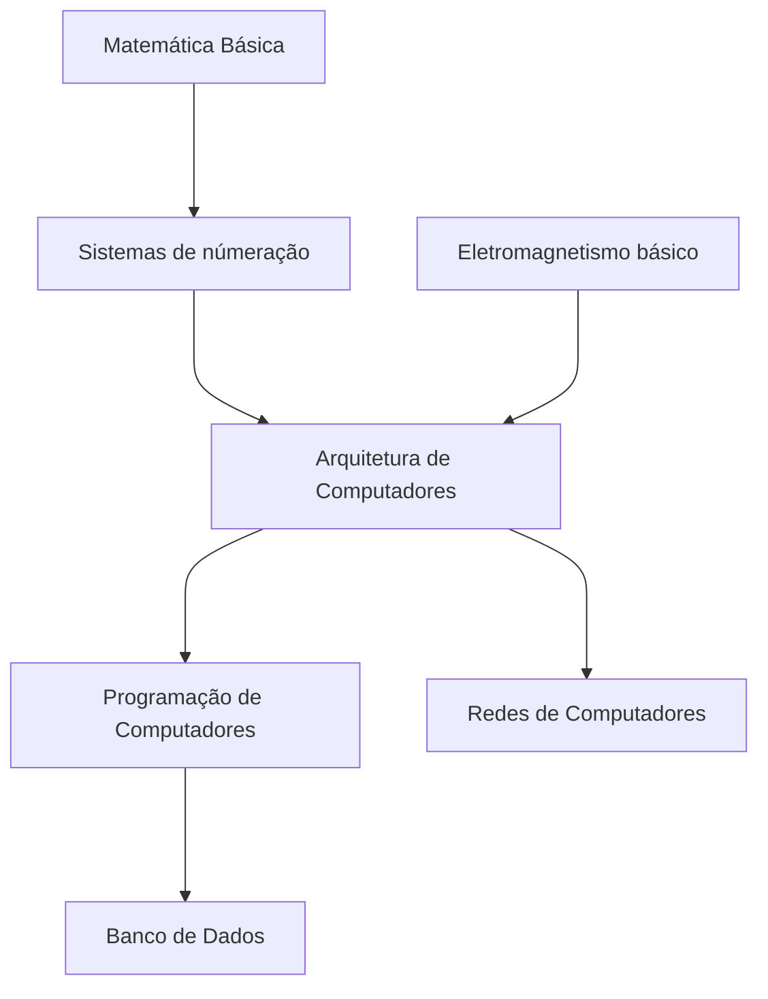

# Guia de Estudos

## Objetivo
Este repositório tem como propósito reunir uma base de conhecimento em língua portuguesa abordando diversos tópicos de segurança da informação. Seu objetivo é tornar-se, no futuro, um guia tanto para novatos que estão iniciando na área quanto para usuários avançados que buscam aprofundar seus conhecimentos.

## Divisão
A segurança da informação pode ser dividida em dois pilares fundamentais:
-   **Defensiva:** responsável por estabelecer medidas de proteção e processos para fortalecer a resiliência de organizações e sistemas contra ameaças.
-   **Ofensiva:** consiste na simulação ativa de ameaças, identificando lacunas nas medidas de proteção existentes para prevenir potenciais casos reais.

## Fundamentos
A área de segurança da informação é complexa e requer uma base sólida nos principais elementos da computação. Abaixo, há um gráfico ilustrativo que demonstra o fluxo de conhecimento necessário para compreender a segurança da informação.

> **Observação:** A base sólida nesses fundamentos permitirão entender todos os temas subsequentes de segurança.

## Padrão de arquivos
Todas as páginas internas seguem a seguinte estrutura:
-   **Introdução:** Breve contextualização sobre o tema, fornecendo uma visão geral.
-   **Fundamentação:** Análise detalhada e aprofundada do assunto, explorando seus aspectos essenciais e relevantes.
-   **Referências e conteúdo adicional:** Listagem das fontes referenciadas no artigo, vídeos complementares, recomendações de livros ou páginas relevantes, laboratórios para treinamento e outros materiais complementares que agreguem valor e aprofundem o entendimento sobre o tema abordado.
> **Nota:** Caso tenha dúvida na estrutura ao qual seu artigo deve ser escrito consulte o documento [exemplo.md](exemplo.md).

## Estrutura
A seguinte estrutura de pasta com seus conteúdos: 
-   **Conceitos Básicos:** Inclui artigos relacionados à computação em geral e seus princípios fundamentais.
-   **Fundamentos de Segurança:** Compreende artigos que abordam conceitos gerais e essenciais no campo da segurança da informação.
-   **Segurança Ofensiva:** Engloba artigos sobre metodologias de ataque, identificação e exploração das principais vulnerabilidades, e outras práticas relacionadas à segurança ativa.
-   **Segurança Defensiva:** Engloba artigos sobre proteção de redes, estratégias de resposta a incidentes, governança, investigação forense, entre outros temas voltados para a defesa e proteção de sistemas.

## Como colaborar
Para colaborar é simples.
Faça um fork desse projeto, crie o artigo na área designada e submeta uma PR para esse projeto.

# Referências externas
- [Cyber Security Roadmap](https://roadmap.sh/cyber-security)
- [Cyber Security Tutorial](https://www.simplilearn.com/tutorials/cyber-security-tutorial)
- [Guia de Cyber Security](https://github.com/arthurspk/guiadecybersecurity)